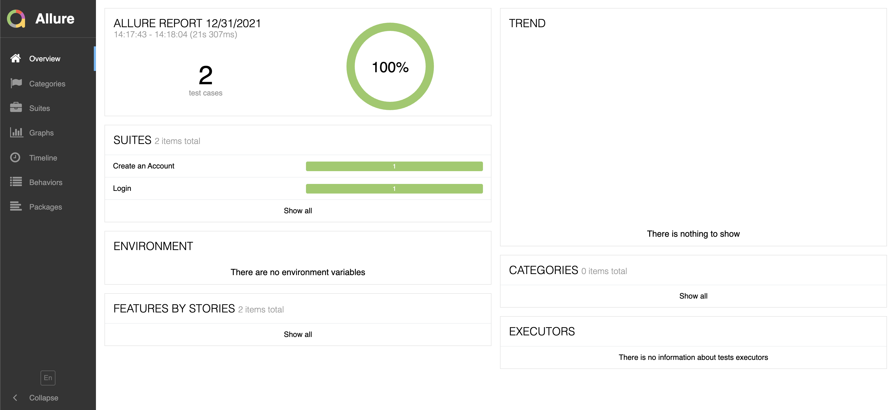

<h1 align="center"> Architecture example using Playwright for UI tests.</h1>

<b>Para acessar a versão em Português do Brasil, basta clicar [aqui](/docs/README-pt_BR.md)! :brazil:</b>

<p>This project was created for a architecture example of UI tests using Playwright + jest</p>

## Technologies and tools used::  
- [JS](https://developer.mozilla.org/pt-BR/docs/Web/JavaScript) 
- [npm](https://www.npmjs.com/)
- [playwright](https://playwright.dev/)
- [jest](https://jestjs.io/)

## Files Structure

📦playwright-arch-example  
 ┣ 📂allure-results  
 ┃ ┣ 📜2094b072-0e34-4f06-856b-8ef4bd346faa-testsuite.xml  
 ┃ ┗ 📜783b98b6-c65f-473d-9bd6-c785ed393d69-testsuite.xml  
 ┣ 📂tests  
 ┃ ┣ 📂pages  
 ┃ ┃ ┣ 📜Base.page.js  
 ┃ ┃ ┣ 📜CreateAccount.page.js  
 ┃ ┃ ┣ 📜Home.page.js  
 ┃ ┃ ┣ 📜MyAccount.page.js  
 ┃ ┃ ┗ 📜SignIn.page.js  
 ┃ ┣ 📂specs  
 ┃ ┃ ┣ 📜createUser.spec.js  
 ┃ ┃ ┗ 📜login.spec.js  
 ┃ ┗ 📂utils  
 ┃ ┃ ┗ 📜Utils.js  
 ┣ 📜.gitignore  
 ┣ 📜README.md  
 ┣ 📜jest-playwright.config.js  
 ┣ 📜jest.config.js  
 ┣ 📜jest.setup.js  
 ┣ 📜package-lock.json  
 ┗ 📜package.json  

## Run examples:

- Install dependencies: ```npm i```
- Run all tests: ```npm run test```


## Report: 
- Open report: ```npm run report:open```  
  - _if the task not correctly run install allure-commandline e o allure by the global way: ```npm i -g allure-commandline allure```_   
  

